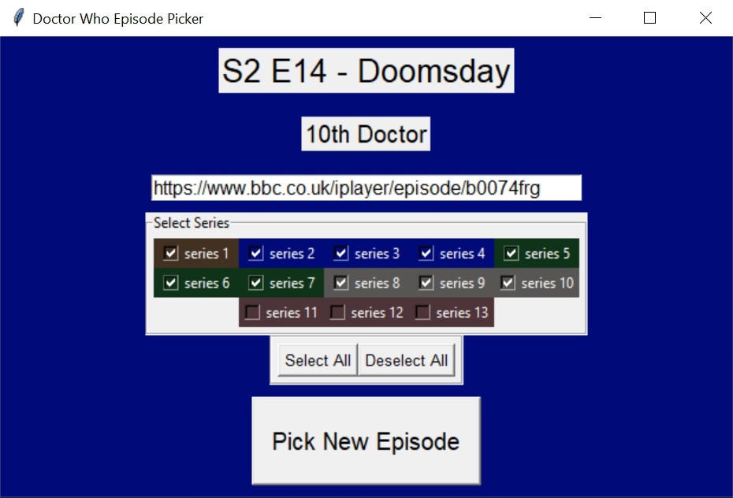
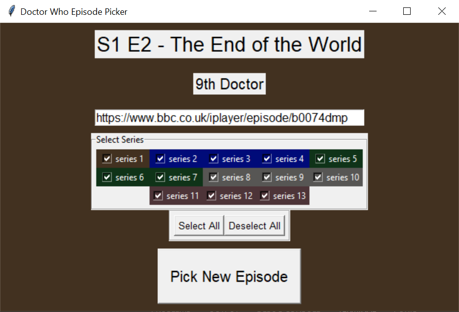
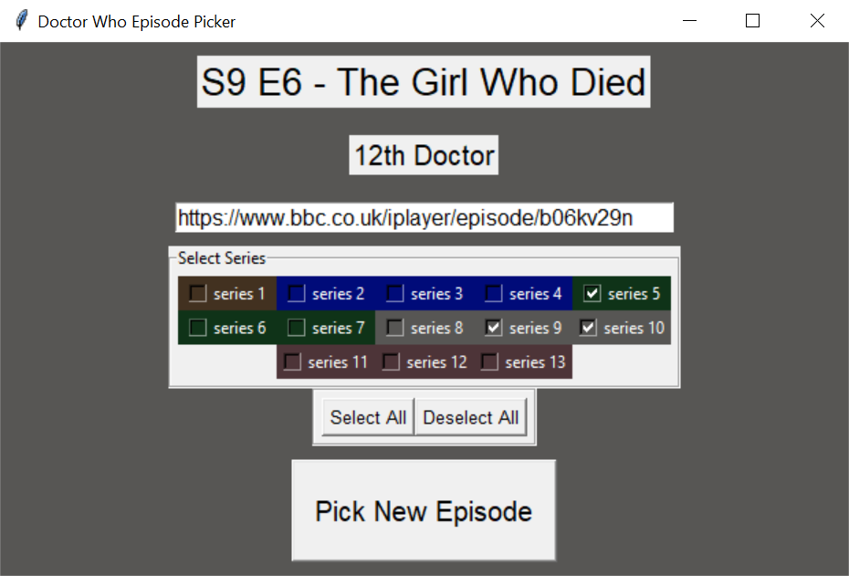
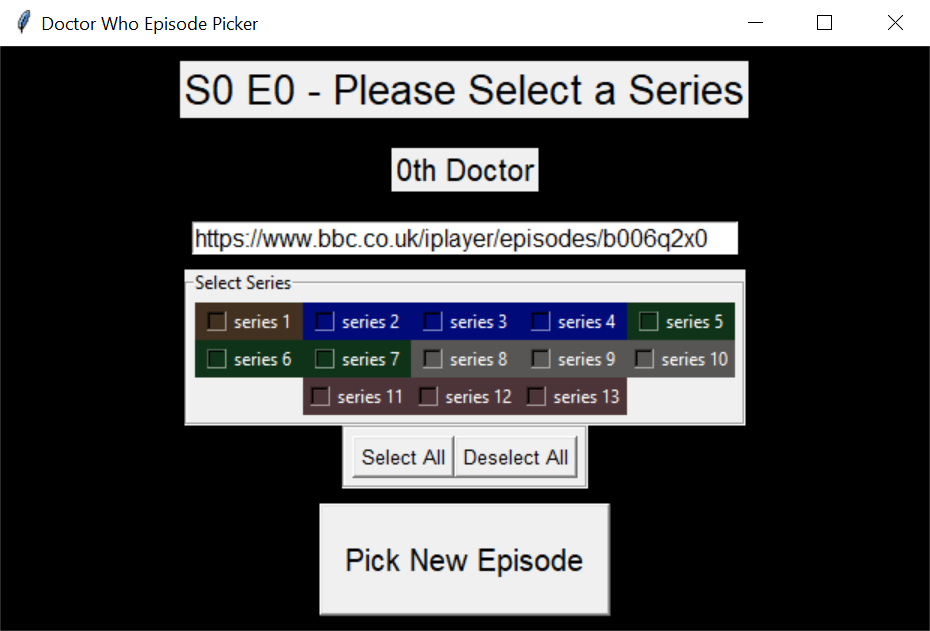

# python-drwho-episode-picker

## A program that Randomly selects episodes of Doctor Who

### ⚠️ This repository is no longer being maintained, as it is being replaced by [a newer version](https://github.com/May-Cook/drwho-episode-picker/tree/main) that uses GitHub pages. ⚠️

This project was created because I often struggle to select what episode of Dr Who to rewatch becauase I find there are two many choices, and I wanted to create a program to create random suggestions. I am creating this for my own benefit but you are welcome to use it if you find it helpful.

This version only includes the 2005-2022 version of the show as the 1963-1996 version was not available on Iplayer when this program was created and I do not wish to continually update it into the future

**Requires `Python 3.10` or later**

## Potential Aims for Project

- provide BBC Iplayer links for the episodes generated
- allow the user to select specific series or doctors
- Create a simple GUI, most likely using tkinter
- Allow for several episodes to be generated to choose from
- Provide basic info about the episode *(eg: companions, episode summary, doctor)*

## I have currently implemented

- selecting a random episode from the 13 series of the revived show *(plus the "Night of the Doctor" minisode)*
- a basic GUI using tkinter
- showing the doctor present in each episode and changes background accordingly *("Day of the Doctor" shows as 11, "Twice Upon a Time" shows as 12)*
- displaying a copyable bbc iplayer link to the episode selected
- selecting episode by series

## Screenshots

